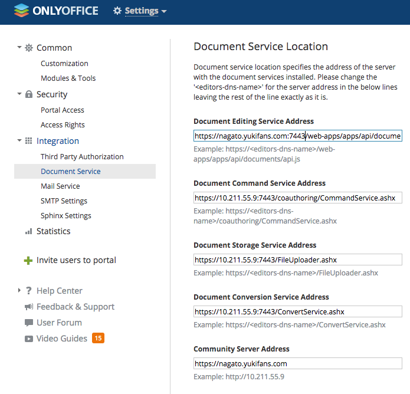

# Onlyoffice Development
OnlyOffice (formerly TeamLab), stylized as ONLYOFFICE, is an open source office suite, developed by Ascensio System SIA, a company with headquarters in Riga, Latvia. Solution features online document editors, platform for document management, corporate communication, mail and project management tools.

## Foreword
官方文件都只有將 **Document** & **Community** 分開安裝架設，或者是用 **Docker** 裝在同一臺伺服器。而本文實作環境只使用一臺伺服器，並自行安裝架設。

## Environment
- RAM：8GB
- HDD：20GB of free space
- Ubuntu 14.04
- IP：10.211.55.9

## Table of Contents
- [Onlyoffice-Document server](#onlyoffice-document-server)
    - [Document dependencies](#document-dependencies)
    - [Install document server](#install-document-server)  
    - [Document command](#document-command)
    - [Document config](#document-config)
    - [Document default port](#document-default-port)
    - [Document default web root](#document-default-web-root)
    - [Document browser URL](#document-browser-url)
- [Onlyoffice-Community server](#onlyoffice-community-server)
    - [Community dependencies](#community-dependencies)
    - [Install Community server](#install-community-server)  
    - [Community use server](#community-use-server)
    - [Community config](#community-config)
    - [Community default port](#community-default-port)
    - [Community default web root](#community-default-web-root)
    - [Community browser URL](#community-browser-url)
- [Connecting Document to Community](#connecting-document-to-community)
- [Troubleshooting](#troubleshooting)

## Onlyoffice-Document Server
[Official](http://helpcenter.onlyoffice.com/server/linux/document/linux-installation.aspx)

### Document dependencies

***Nodejs***  
新增來源庫並安裝。
```bash
ubuntu@localhost:~$ echo "deb http://archive.ubuntu.com/ubuntu precise main universe multiverse" | sudo tee -a /etc/apt/sources.list
ubuntu@localhost:~$ curl -sL https://deb.nodesource.com/setup_6.x | sudo bash -
```

***Postgre***  
安裝並新增使用者與資料庫。
```bash
ubuntu@localhost:~$ sudo apt-get install postgresql
ubuntu@localhost:~$ sudo -i -u postgres psql -c "CREATE DATABASE onlyoffice;"
ubuntu@localhost:~$ sudo -i -u postgres psql -c "CREATE USER onlyoffice WITH password 'onlyoffice';"
ubuntu@localhost:~$ sudo -i -u postgres psql -c "GRANT ALL privileges ON DATABASE onlyoffice TO onlyoffice;"
```

***redis ＆ rabbitmq***
```bash
ubuntu@localhost:~$ sudo apt-get install redis-server
ubuntu@localhost:~$ sudo apt-get install rabbitmq-server
```

### Install document server

變更 Document server 安裝後的監聽 Port。
```bash
ubuntu@localhost:~$ echo onlyoffice-documentserver onlyoffice/ds-port select 7080 | sudo debconf-set-selections
```

新增 Document server 來源並安裝。
```bash
ubuntu@localhost:~$ sudo apt-key adv --keyserver hkp://keyserver.ubuntu.com:80 --recv-keys CB2DE8E5
ubuntu@localhost:~$ sudo echo "deb http://download.onlyoffice.com/repo/debian squeeze main" | sudo tee /etc/apt/sources.list.d/onlyoffice.list
ubuntu@localhost:~$ sudo apt-get update
ubuntu@localhost:~$ sudo apt-get install onlyoffice-documentserver
```

### Document command
列出一些比較常用的指令，以及該指令的位置。如果有變更 config，你就會需要它。  
```bash
ubuntu@localhost:~$ documentserver-
documentserver-collect-lost.sh       documentserver-generate-allfonts.sh  
documentserver-prepare4shutdown.sh   documentserver-update-securelink.sh

ubuntu@localhost:~$ ls /usr/bin/documentserver-
documentserver-collect-lost.sh       documentserver-generate-allfonts.sh
documentserver-prepare4shutdown.sh   documentserver-update-securelink.sh
```

### Document config
列出相關的配置檔位置。Nginx 裡的主要檔案是 `onlyoffice-documentserver.conf`，由它 include 進需要的進來。
```bash
ubuntu@localhost:~$ ls /etc/nginx/conf.d/
onlyoffice-documentserver-ssl.conf.template  onlyoffice-documentserver.conf  onlyoffice-documentserver.conf.template

ubuntu@localhost:~$ ls /etc/nginx/includes/
onlyoffice-documentserver-common.conf  onlyoffice-documentserver-docservice.conf
onlyoffice-documentserver-spellchecker.conf  onlyoffice-http.conf

ubuntu@localhost:~$ ls /etc/onlyoffice/documentserver/
default.json              development-mac.json      development-windows.json
log4js/                   production-linux.json     production-windows.json
```

### Document default port 
[Linked](http://helpcenter.onlyoffice.com/server/docker/document/open-ports.aspx)

Port 設定可以到 `default.json` 裡面看到，還有一些官方沒提到的 Port 應用。

- HTTP：80
- HTTPS：443
- PostgreSQL：5432
- RabbitMQ：5672
- Redis：6379
- DocService：8000
- Spellchecker：8080


### Document default web root
預設的網頁服務根目錄。
```bash
ubuntu@localhost:~$ ls /var/www/onlyoffice/documentserver/server/
Common/        DocService/    FileConverter/ Metrics/
schema/        SpellChecker/  tools/         welcome/  
```

### Document browser URL
打上主機位子就會自動到 `welcome` 目錄的 `index`。

```
http://nagato.yukifans.com:7080/welcome/
```

## Onlyoffice Community server
[Official](http://helpcenter.onlyoffice.com/server/linux/community/linux-installation.aspx#introduction)

### Community dependencies

***Mono - [Linked](http://www.mono-project.com/download/#download-lin)***

```bash
ubuntu@localhost:~$ sudo apt-key adv --keyserver hkp://keyserver.ubuntu.com:80 --recv-keys 3FA7E0328081BFF6A14DA29AA6A19B38D3D831EF
ubuntu@localhost:~$ echo "deb http://download.mono-project.com/repo/ubuntu trusty main" | sudo tee /etc/apt/sources.list.d/mono-official.list
ubuntu@localhost:~$ sudo apt-get update
ubuntu@localhost:~$ sudo apt-get install mono-devel
```

### Install Community server
新增來源庫並安裝。
```bash
ubuntu@localhost:~$ sudo apt-key adv --keyserver hkp://keyserver.ubuntu.com:80 --recv-keys CB2DE8E5
ubuntu@localhost:~$ sudo echo "deb http://download.onlyoffice.com/repo/debian squeeze main" | sudo tee /etc/apt/sources.list.d/onlyoffice.list
ubuntu@localhost:~$ sudo apt-get update
ubuntu@localhost:~$ sudo apt-get install onlyoffice-communityserver
```

### Community use server
因為實在找不到 Community Server 主要運行的指令或腳本。雖然不曉得它如何運作，但至少要知道運行了什麼服務。
- MySQL
- monoserve
- monoserveApiSystem
- onlyofficeAutoreply
- onlyofficeFeed
- onlyofficeJabber
- onlyofficeSignalR
- onlyofficeIndex
- onlyofficeNotify
- onlyofficeBackup
- onlyofficeMailAggregator
- onlyofficeMailWatchdog

### Community config
列出相關的配置檔位置。Nginx 裡的主要檔案是 `onlyoffice`，由它 include 進需要的進來。
```bash
ubuntu@localhost:~$ ls /etc/nginx/sites-available/
default          onlyoffice       

ubuntu@localhost:~$ ls /etc/nginx/includes/
onlyoffice-communityserver-common.conf
onlyoffice-communityserver-common.conf.template
onlyoffice-communityserver-common-init.conf.template
onlyoffice-communityserver-common-ssl.conf.template
onlyoffice-communityserver-letsencrypt.conf
onlyoffice-communityserver-nginx.conf.template
onlyoffice-communityserver-proxy-to-controlpanel.conf.template
onlyoffice-communityserver-proxy-to-documentserver.conf
onlyoffice-communityserver-proxy-to-documentserver.conf.template
onlyoffice-communityserver-services.conf
onlyoffice-communityserver-letsencrypt.conf

ubuntu@localhost:~$ ls /var/www/onlyoffice/
ApiSystem/          Data/               Logs/               Services/           Tools/              
.config/            DocumentServerData/ .mono/              Sql/                WebStudio/         
```

### Community default port
[Linked](http://helpcenter.onlyoffice.com/server/docker/community/open-ports.aspx)

- SMTP：25
- HTTP：80
- POP3：110
- IMAP：143
- HTTPS：443
- SMTPS：465
- IMAPS：993
- POP3S：995
- MySQL：3306
- Talk：5222
- DocService：9001
- Jabber：9865
- Notify：9871
- ReverseJabber：9888

### Community Default web root
預設的網頁服務根目錄。
```bash
ubuntu@localhost:~$ ls /var/www/onlyoffice/WebStudio/
401.htm                      change.log                   My.aspx                      Tariffs.aspx
402.htm                      confirm.aspx                 PaymentRequired.aspx         Templates/
403.aspx                     Controls/                    PreparationPortal.aspx       Terms.aspx
403.htm                      Core/                        Products/                    UserControls/
404.aspx                     Default.aspx                 Properties/                  Utility/
404.htm                      favicon.ico                  PublicResources/             VoipClient.aspx
500.aspx                     Feed.aspx                    robots.txt                   Warmup.aspx
500.htm                      Global.asax                  Search.aspx                  web.appsettings.config
About.aspx                   googleb46d076df2fc5934.html  ServerError.aspx             Web.config
addons/                      HttpHandlers/                Services/                    web.connections.config
App_Data/                    js/                          skins/                       web.consumers.config
App_Start/                   login.ashx                   StartConfigure.htm           web.log4net.config
App_Themes/                  Management.aspx              StartScriptsStyles.aspx      web.storage.config
Auth.aspx                    manifest.json                StartUp.aspx                 web.unity.config
bin/                         Masters/                     Startup.htm                  Wizard.aspx
Certificates/                migration-portal.htm         StartUpSaaS.aspx             
```

### Community browser URL
```
http://nagato.yukifans.com/Default.aspx
```

## Connecting Document to Community
[Official](https://helpcenter.onlyoffice.com/server/windows/document/connect-document-server.aspx)  
[Official-vdeio](https://youtu.be/7kiJ99tmsi0?t=3m59s)  

設定如圖所示。但仍建議先參考官方文件，在配合當前環境做設定變更。


