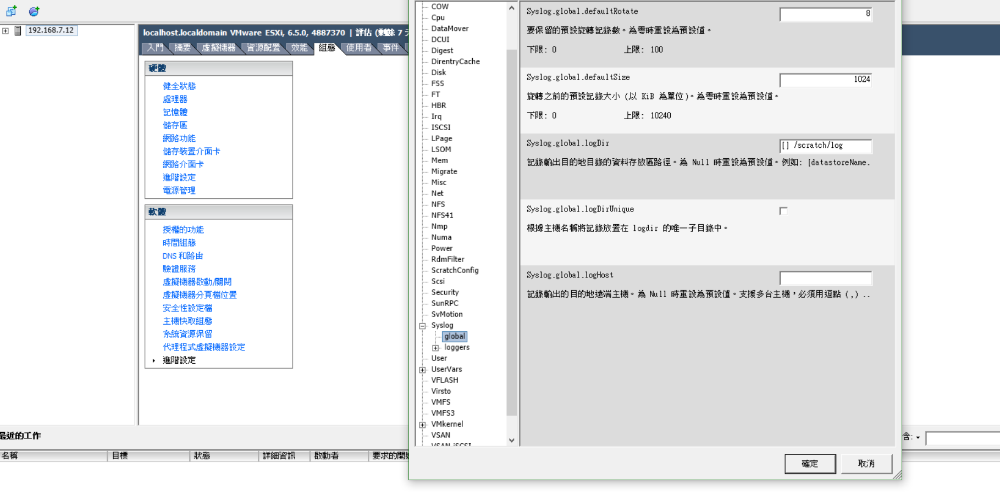

# Syslog

## environment
- [rsyslog](https://github.com/CCH0124/Business/blob/master/ubuntu/rsyslog.md) 架設完畢

## Setting

主機 > 組態 > 進階設定 > syslog > global  


填入遠端 rsyslog server host

`Syslog.global.logHost` 設置 `udp://ip-address-or-domain-name:514`

## check

查看 `loghost` 是否有遠端
```bash
[root@localhost:~] cat /etc/vmsyslog.conf
[DEFAULT]
rotate = 8
check_ssl_certs = true
logdir = <none>
default_timeout = 180
drop_log_rotate = 10
queue_drop_mark = 90
size = 1024
logdir_unique = false
loghost = <none>
drop_log_size_kb = 100

[vmsyslog]
rotate = 8
size = 1024
logdir_unique = false
loghost = udp://192.168.7.19:514
```

[Official article](https://docs.vmware.com/tw/VMware-vSphere/6.5/com.vmware.vsphere.monitoring.doc/GUID-9F67DB52-F469-451F-B6C8-DAE8D95976E7.html)
