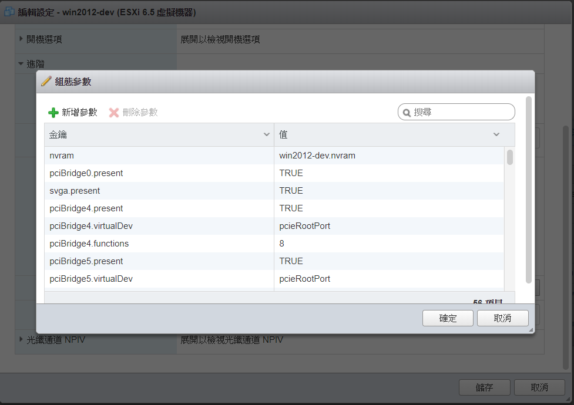

# Troubleshooting 

## Issue
- [Windows](#windows)
  - [failed bios lock](#failed-bios-lock)

## Windows 
### Failed bios lock
#### Solution

虛擬機 -> 虛擬機器選項 -> 進階 -> 組態參數 -> 編輯組態\

新增參數：`smbios.ReflectHost=TRUE`

